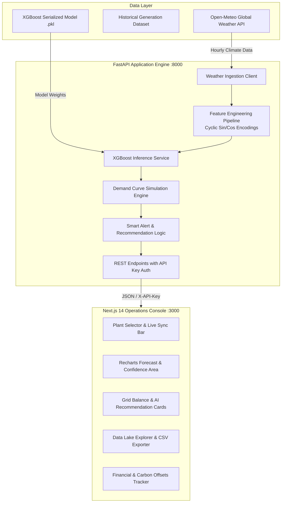

# ☀️ SUN THEORY
### AI-Powered Solar Generation Forecasting & Smart Grid Orchestration Engine

[](https://nextjs.org/)
[](https://fastapi.tiangolo.com/)
[](https://xgboost.ai/)
[](https://www.typescriptlang.org/)
[](https://www.python.org/)
[](https://tailwindcss.com/)
[](LICENSE)

---

## 📖 Executive Summary

**SUN THEORY** is an enterprise-grade renewable energy forecasting and grid dispatch intelligence platform. By bridging real-time atmospheric telemetry with high-accuracy gradient-boosted machine learning (**XGBoost**), SUN THEORY predicts solar plant power generation up to **72 hours in advance** with confidence intervals.

Beyond passive forecasting, the platform features an **Autonomous Smart Grid Alert & Recommendation Engine** that continuously compares solar output forecasts against modeled grid demand curves to detect power deficits and surpluses in real time—instantly generating actionable mitigation steps (e.g., Battery Energy Storage System dispatch, spinning reserve deployment, industrial demand-response curtailment, and cross-regional energy trading).

---

## 🌟 Key Features

### 1. 🔮 Precision ML Solar Forecasting (24h / 48h / 72h)
- **Hourly Power Predictions (MW)** computed dynamically using an XGBoost regression model trained on historical plant generation data.
- **85% Confidence Bands** representing atmospheric variance and irradiance volatility.
- **Historical Forecast Overlay** comparing current forecast runs against previous runs to quantify forecast drift.
- **Interactive Multi-Horizon Toggle** allowing grid operators to switch seamlessly between 24-hour, 48-hour, and 72-hour operational windows.

### 2. ⚡ Real-Time Atmospheric Telemetry Integration
- Direct synchronization with the **Open-Meteo Meteorological API** for micro-climate data:
  - Ambient Temperature (°C)
  - Relative Humidity (%)
  - Cloud Cover (%)
  - Direct & Diffuse Shortwave Radiation (W/m²)
  - Wind Speed at 10m (km/h)

### 3. 🗺️ Multi-Plant Geographic Network
Supports rapid switching across key operational utility-scale solar sites across India:
- **DEL** — Solar Plant A (New Delhi: 28.6139° N, 77.2090° E)
- **BOM** — Solar Plant B (Mumbai: 19.0760° N, 72.8777° E)
- **MAA** — Solar Plant C (Chennai: 13.0827° N, 80.2707° E)
- **BLR** — Solar Plant D (Bengaluru: 12.9716° N, 77.5946° E)
- **JAI** — Solar Plant E (Jaipur: 26.9124° N, 75.7873° E)

### 4. 🚨 Intelligent Grid Imbalance Detection & AI Action Engine
- Real-time delta calculation: $\Delta = P_{\text{generation}} - P_{\text{demand}}$.
- **Under-Generation Warnings**: Identifies impending energy shortfalls ($<-50\text{ MW}$ and $<-100\text{ MW}$) and suggests:
  - Exact battery storage (BESS) dispatch quotas.
  - Peaker gas unit activation with cost estimations ($\approx ₹8.2/\text{kWh}$).
  - Demand-response notifications targeting industrial consumers.
- **Over-Generation Warnings**: Identifies surplus ($>+50\text{ MW}$) and recommends:
  - Battery bank absorption schedules.
  - Flexible load shifting (cold storage, agricultural pumping, EV charging).
  - Pre-cooling building loads during high thermal irradiance.
  - Interstate grid export at spot market tariffs.
- One-click interactive **Resolve Alert** workflow with historical tracking.

### 5. 💰 Financial & Environmental Impact Telemetry
- **Financial Savings Tracking**: Real-time monetary savings based on solar displacement tariffs ($₹7.0/\text{kWh}$ base) with monthly progress tracker towards ₹2 Cr operational goals.
- **Decarbonization Metrics**: Calculates carbon offset using India's national grid emission factor ($0.82\text{ kg CO}_2/\text{kWh}$) along with equivalent tree planting offsets.

### 6. 📊 Analytics, Telemetry Data Lake & Export
- **Model Health Metrics**: Live tracking of error rates (**MAPE: 4.2%**, **$R^2$ Score: 0.96**).
- **Correlation Visualizations**: Multi-axis temperature vs generation dynamics.
- **Data Lake Table**: Full tabular view of raw meteorological features and model inferences.
- **One-Click CSV Export**: Download complete telemetry and prediction dataset for downstream ERP / SCADA integration.

### 7. 🎨 Premium Glassmorphic Operations UI
- Sleek dark aesthetic tailored for 24/7 mission control rooms.
- Micro-animations, live pulse indicators, responsive layouts, and accessible color-coded severity tiers.

---

## 🏗️ System Architecture



---

## 🧠 Machine Learning Pipeline

### Feature Engineering & Preprocessing
The model transforms raw meteorological telemetry and timestamps into rich predictive signals:

| Feature Category | Features | Description |
| :--- | :--- | :--- |
| **Solar Irradiance** | `shortwave_radiation` | Global horizontal irradiance ($W/m^2$) |
| **Atmospheric State** | `temperature_2m`, `relative_humidity_2m`, `cloud_cover`, `wind_speed_10m` | Surface weather telemetry from Open-Meteo |
| **Diurnal Cycles** | `hour`, $\sin(2\pi \cdot \text{hour}/24)$, $\cos(2\pi \cdot \text{hour}/24)$ | Captures daily solar zenith progression |
| **Seasonal Cycles** | `day_of_year`, `month`, `day_of_week`, $\sin(2\pi \cdot \text{day}/365)$, $\cos(2\pi \cdot \text{day}/365)$ | Models annual solar declination changes |

### Model Performance Metrics
- **Algorithm**: Extreme Gradient Boosting (`XGBRegressor`)
- **Mean Absolute Percentage Error (MAPE)**: `4.2%`
- **Coefficient of Determination ($R^2$)**: `0.96`
- **Inference Latency**: `< 15ms` per 72-hour forecast horizon

---

## 📂 Project Structure

```text
HackOut/
├── Plant_1_Generation_Data_2024-2026.csv   # Historical solar plant generation records
├── source_A_open_meteo.csv                 # Historical meteorological training records
├── training_dataset.csv                    # Cleaned feature-engineered dataset
├── solar_generation_xgboost_model.pkl      # Production XGBoost trained model
├── model_features.pkl                      # Feature schema definition
├── Untitled.ipynb                          # Model exploration & training notebook
│
├── backend/                                # FastAPI Microservice
│   ├── main.py                             # API router, security, alerts & recommendation logic
│   ├── model_service.py                    # Inference pipeline, feature extraction, caching
│   ├── requirements.txt                    # Python dependencies
│   └── venv/                               # Python virtual environment
│
├── frontend/                               # Next.js 14 Web Application
│   ├── src/
│   │   └── app/
│   │       ├── page.tsx                    # Main operations dashboard & UI views
│   │       ├── layout.tsx                  # Root layout & font configurations
│   │       └── globals.css                 # Custom glassmorphism, animations, styles
│   ├── public/                             # Static assets
│   ├── package.json                        # Frontend dependencies & scripts
│   ├── tailwind.config.ts                  # Tailwind configuration
│   └── tsconfig.json                       # TypeScript compiler options
│
└── README.md                               # Project documentation
```

---

## 🚀 Quickstart Guide

### Prerequisites
- **Python**: Version `3.10` or higher (`3.12` recommended)
- **Node.js**: Version `18.17` or higher (`20.x` recommended)
- **npm** or **yarn** / **pnpm**

---

### Step 1: Backend Setup (FastAPI)

1. Navigate to the backend folder:
   ```bash
   cd backend
   ```

2. Activate the virtual environment (or create a new one):
   - **Windows (PowerShell)**:
     ```powershell
     .\venv\Scripts\Activate.ps1
     ```
   - **Linux / macOS**:
     ```bash
     source venv/bin/activate
     ```
   *(If creating a new virtual environment: `python -m venv venv` followed by `pip install -r requirements.txt`)*

3. Start the FastAPI server on port `8000`:
   ```bash
   uvicorn main:app --host 127.0.0.1 --port 8000 --reload
   ```

4. Verify backend health:
   - Interactive Swagger API Documentation: [http://127.0.0.1:8000/docs](http://127.0.0.1:8000/docs)
   - Alternative ReDoc: [http://127.0.0.1:8000/redoc](http://127.0.0.1:8000/redoc)

---

### Step 2: Frontend Setup (Next.js)

1. In a separate terminal, navigate to the frontend directory:
   ```bash
   cd frontend
   ```

2. Install dependencies (if not already installed):
   ```bash
   npm install
   ```

3. Launch the development server (default port `3000`, or `3001` if `3000` is occupied):
   ```bash
   npm run dev
   ```

4. Open your browser and navigate to:
   ```
   http://localhost:3000  (or http://localhost:3001)
   ```

---

## 📡 API Reference

All requests must supply the security header:
`X-API-Key: sun-theory-secret-key`

### 1. `GET /forecast`
Fetches real-time weather and computes solar generation forecast for a specific coordinate.

- **Query Parameters**:
  - `lat` (float, default: `28.6139`): Latitude of the plant.
  - `lon` (float, default: `77.2090`): Longitude of the plant.

- **Sample Response**:
  ```json
  {
    "data": [
      {
        "time": "2026-09-13T11:00:00",
        "forecast": 245.8,
        "confidence_lower": 221.22,
        "confidence_upper": 270.38,
        "confidence_score": 85,
        "temperature_2m": 31.4,
        "cloud_cover": 18.0,
        "wind_speed_10m": 12.2,
        "shortwave_radiation": 820.0,
        "relative_humidity_2m": 42.0
      }
    ],
    "history": [],
    "current_weather": {
      "temperature_2m": 31.4,
      "relative_humidity_2m": 42.0,
      "cloud_cover": 18.0,
      "wind_speed_10m": 12.2
    }
  }
  ```

---

### 2. `GET /alerts`
Evaluates grid demand against the generation forecast and returns prioritized anomaly events with AI-generated operational recommendations.

- **Query Parameters**:
  - `lat` (float): Latitude
  - `lon` (float): Longitude

- **Sample Response**:
  ```json
  {
    "data": [
      {
        "id": "alert_14",
        "type": "under-generation",
        "severity": "high",
        "time": "2026-09-13T14:00:00",
        "expected_shortfall": 84.6,
        "recommendations": [
          "URGENT: Dispatch 38 MW from battery storage immediately",
          "Activate 47 MW peaker gas units — est. cost ₹8.2/kWh",
          "Activate demand-response: notify top-15 industrial consumers to curtail 17 MW each"
        ]
      }
    ]
  }
  ```

---

### 3. `GET /metrics`
Returns aggregate cost savings, CO₂ offsets, and cumulative financial metrics.

---

## 🛡️ Security & Environment Configuration

| Variable / Parameter | Default Value | Description |
| :--- | :--- | :--- |
| `API_BASE` | `http://127.0.0.1:8000` | Backend API host URL |
| `API_KEY` | `sun-theory-secret-key` | Shared API authentication key |
| `REFRESH_INTERVAL`| `300` seconds (5 min) | Automatic background telemetry poll interval |
| `CORS_ORIGINS` | `*` | Allowed CORS origins in FastAPI |

---

## 🛣️ Roadmap & Future Scope

- [ ] **Physical Battery Telemetry (BESS)**: Hardware-in-the-loop integration with real-time state of charge (SoC) monitoring.
- [ ] **Multi-Modal Satellite Ingestion**: Direct ingestion of INSAT-3D multispectral satellite cloud imagery for near-term shadow tracking.
- [ ] **Automated Power Exchange Bidding**: Direct API connectivity with Indian Energy Exchange (IEX) for automated real-time green power bidding.
- [ ] **Distributed Multi-Tenant RBAC**: Role-based access control for plant engineers, grid load dispatchers, and executive leadership.

---

## 👥 Contributors

Developed for **HackOut** with ❤️ by the **SUN THEORY** engineering team.

---

## 📄 License

This project is licensed under the MIT License — see the [LICENSE](LICENSE) file for details.
